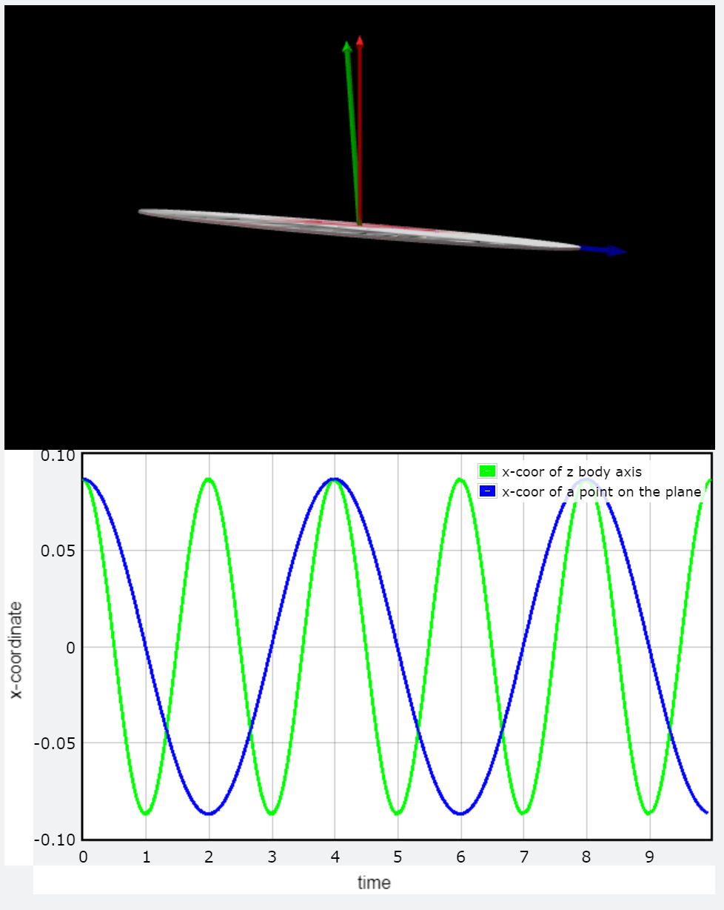

# Feynmans-Wobbling-Plate
A simulation for Feynman's Wobbling Plate by using VPython

Note: First Euler angle of the system is choosen to be big (omega = pi/2) for demonstratation purposes and it does not affect the wobble:spin ratio. The implementation of this code is done for a small omega which can be neglected.

## How To Use:

1- Clone/Download the repository to your computer (check the repo address) 

`git clone https://github.com/oonacitarhan/Feynmans-Wobbling-Plate.git` or just click Download ZIP and extract it

2- Go to the directory where you cloned/downloaded the repository and install the requirements

`pip install -r requirements.txt`

3- Start the simulation

`python3 sim.py` or `python sim.py` 
